# [译] 如何使用 RxJS 6 + Recompose 在 React 中构建 Github 搜索功能

> 原文链接：[How to build GitHub search functionality in React with RxJS 6 and Recompose](https://medium.freecodecamp.org/how-to-build-a-github-search-in-react-with-rxjs-6-and-recompose-e9c6cc727e7f)<br/>
> 原文作者：[Yazeed Bzadough](https://medium.freecodecamp.org/@yazeedb)<br/>
> 译者：[yk](https://github.com/m8524769)；如需转载，请注明[出处](https://github.com/m8524769/RxJS-Article-Translation)，谢谢合作！


本篇文章适合有 React 和 RxJS 使用经验的读者。以下仅仅是我个人在设计下面这个 UI 时觉得有用的模式，在此分享给大家。

这将会是我们的成果：

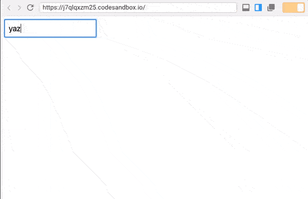

没有 Class，没有生命周期钩子，也没有 `setState`。

## 安装

所有代码都可以在我 [Github](https://github.com/yazeedb/recompose-github-ui) 上找到。

```shell
git clone [https://github.com/yazeedb/recompose-github-ui](https://github.com/yazeedb/recompose-github-ui)
cd recompose-github-ui
yarn install
```

`master` 分支是一个已完成的项目，如果你想要独自继续开发的话，可以新建一个 `start` 分支。

```shell
git checkout start
```

然后运行程序。

```shell
npm start
```

应用会运行在 `localhost:3000`，这是最初的效果。


用你最喜欢的编辑器打开项目，进入 `src/index.js`。

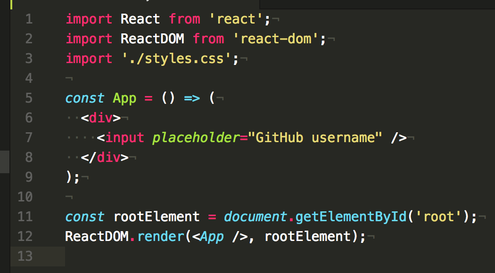

## Recompose

如果你之前没见过 [Recompose](https://github.com/acdlite/recompose/)，我会告诉你这玩意儿是一个非常棒的 React 工具集，可以让你以函数式编程的风格来编写组件。该工具集提供了非常多的功能，在其中做出[选择](https://medium.com/@yazeedb/my-favorite-recompose-functions-c8ff98ea308f#9da6-2f8c5cce0b28)真不是件容易事儿。

它就相当于应用在 React 里的 Lodash/Ramda。

另外，令我惊喜的是，他们还支持 observables（可观察对象）。引用[文档](https://github.com/acdlite/recompose/blob/master/docs/API.md#observable-utilities)里的一句话：

> _事实证明，大部分 React 组件的 API 都可以用 observable 来替代。_

今天我们就来实践这个概念！😁

## 让我们的组件“流”起来

假如现在有一个普通的 React 组件 `App`，我们可以通过使用 Recompose 的 [`componentFromStream`](https://github.com/acdlite/recompose/blob/master/docs/API.md#componentfromstream) 函数来以 observable 的方式这个重新定义这个组件。

这个函数最初会渲染[一个值为 `null` 的组件](https://github.com/acdlite/recompose/blob/master/src/packages/recompose/componentFromStream.js#L8)，一旦我们的 observable 返回了一个新的值，该组件就会被重新渲染。

### 快速配置

Recompose 的流遵循了 [`ECMAScript 的 Observable 提案`](https://github.com/tc39/proposal-observable)。该提案指出了 observables 在最终交付给现代浏览器时应该如何运作。

在提案的内容被完全实现之前，我们只能依赖于类似 RxJS，xstream，most，Flyd 等等库。

Recompose 并不知道我们使用的具体是哪个库，因此它提供了 `setObservableConfig` 来将 ES Observable 转换为任何我们需要的形式。

首先，在 `src` 中创建一个名为 `observableConfig.js` 的文件。

然后添加如下代码，使 Recompose 兼容 RxJS 6：

```javascript
import { from } from 'rxjs';
import { setObservableConfig } from 'recompose';

setObservableConfig({
  fromESObservable: from
});
```

将其导入至 `index.js`：

```javascript
import './observableConfig';
```

准备完毕！

### Recompose + RxJS

导入 `componentFromStream`。

```javascript
import React from 'react';
import ReactDOM from 'react-dom';
import { componentFromStream } from 'recompose';
import './styles.css';
import './observableConfig';
```

开始重新定义 `app`：

```javascript
const App = componentFromStream(prop$ => {
  ...
});
```

注意，`componentFromStream` 需要一个回调函数作为参数，该回调函数订阅了一个 `prop$` 数据流。想法是将我们的 `props` 转变为一个 observable，然后再将它们映射到 React 组件里。

如果你用过 RxJS，那么你应该知道哪种操作符最适合拿来做 _映射_（map）。

### Map

顾名思义，该操作符用于将 `Observable(something)` 转变为 `Observable(somethingElse)`。在我们的例子中，则是将 `Observable(props)` 转变为 `Observable(component)`。

导入 `map` 操作符：

```javascript
import { map } from 'rxjs/operators';
```

然后重新定义 App：

```javascript
const App = componentFromStream(prop$ => {
  return prop$.pipe(
    map(() => (
      <div>
        <input placeholder="GitHub username" />
      </div>
    ))
  )
});
```

自 RxJS 5 以来，都应当使用 `pipe` 来代替连接操作符。

保存并查看效果，果不其然！

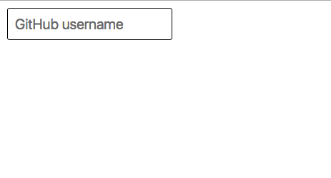

## 添加一个事件处理器

现在，让我们把 `input` 变得更 reactive （响应式）一些。

从 Recompose 导入 `createEventHandler`。

```javascript
import { componentFromStream, createEventHandler } from 'recompose';
```

代码如下：

```javascript
const App = componentFromStream(prop$ => {
  const { handler, stream } = createEventHandler();

  return prop$.pipe(
    map(() => (
      <div>
        <input
          onChange={handler}
          placeholder="GitHub username"
        />
      </div>
    ))
  )
});
```

`createEventHandler` 对象有两个很有意思的属性：`handler` 和 `stream`。

在[底层实现](https://github.com/acdlite/recompose/blob/master/src/packages/recompose/createEventHandler.js)方面，`handler` 其实就是一个将数据推送给 `stream` 的事件发射器，而 `stream` 则是把这些数据广播给其订阅者的一个 observable 对象。

在这里使用 `combineLatest` 会是一个很好的选择。

### 先有鸡还是先有蛋？

但要使用 `combineLatest`，`stream` 和 `prop$` 都必须被发射（emit）。而在 `prop$` 发射之前，`stream` 是不会被发射的，反之亦然。

我们可以通过给 `stream` 一个初始值来解决这个问题。

导入 RxJS 的 `startWith` 操作符：

```javascript
import { map, startWith } from 'rxjs/operators';
```

然后创建一个新的变量来捕获变更后的 `stream`。

```javascript
const { handler, stream } = createEventHandler();

const value$ = stream.pipe(
  map(e => e.target.value),
  startWith('')
);
```

我们知道 `stream` 会在 `input` 的文本值发生改变时发射事件，所以我们可以将每个事件都映射为其改变后的文本值。

最重要的是，我们将 `value$` 初始化为一个空字符串，以便于在 `input` 为空时得到一个合理的默认值。

### 合二为一

现在我们准备将这两个数据流组合到一起，并导入 `combineLatest` 作为创建方法，**而非作为操作符**。

```javascript
import { combineLatest } from 'rxjs';
```

你也可以导入 `tap` 用于实时检查数据：

```javascript
import { map, startWith, tap } from 'rxjs/operators';
```

具体写法如下：

```javascript
const App = componentFromStream(prop$ => {
  const { handler, stream } = createEventHandler();
  const value$ = stream.pipe(
    map(e => e.target.value),
    startWith('')
  );

  return combineLatest(prop$, value$).pipe(
    tap(console.warn),
    map(() => (
      <div>
        <input
          onChange={handler}
          placeholder="GitHub username"
        />
      </div>
    ))
  )
});
```

现在，每当你输入一个字符时，`[props, value]` 就会被记录下来。

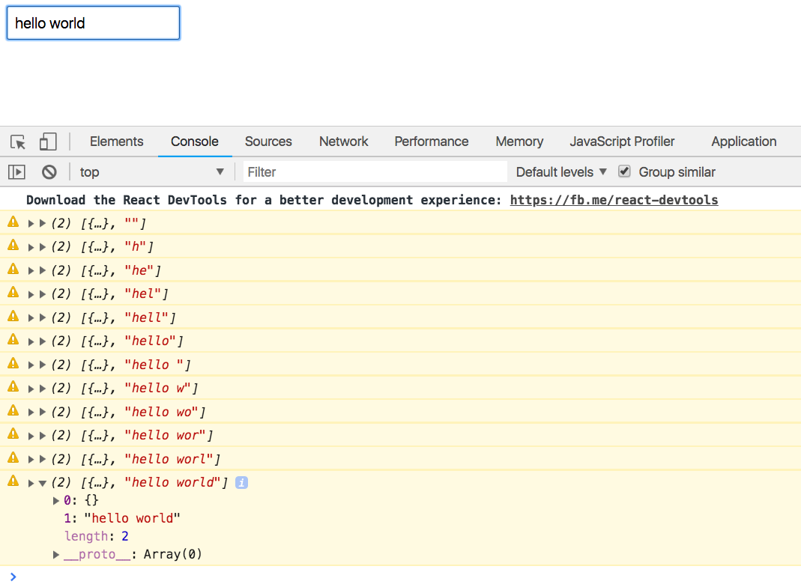

## 用户组件

该组件将负责获取并显示我们输入的用户名。它会收到来自 `App` 的 `value`，并将其映射为 AJAX 请求。

### JSX/CSS

这部分完全是基于一个叫 [Github Cards](https://lab.lepture.com/github-cards/) 的项目，该项目非常之优秀。本教程大部分代码，尤其是编码风格都是照搬过来并用 React 和 props 重写的。

首先，新建一个文件夹 `src/User`，并将[这段代码](https://raw.githubusercontent.com/yazeedb/recompose-github-ui/master/src/User/User.css)放进 `User.css`。

然后将[这段代码](https://raw.githubusercontent.com/yazeedb/recompose-github-ui/master/src/User/Component.js)放进 `src/User/Component.js`。

可见，该组件只包含了一个 Github API 的标准 JSON 响应模板。

### 容器

> 译者注：这里的“容器”指容器组件（Container Component）

现在，可以把这个“单调”的组件放一边了，让我们来实现一个更为“智能”的组件：

新建 `src/User/index.js`，代码如下：

```javascript
import React from 'react';
import { componentFromStream } from 'recompose';
import {
  debounceTime,
  filter,
  map,
  pluck
} from 'rxjs/operators';
import Component from './Component';
import './User.css';

const User = componentFromStream(prop$ => {
  const getUser$ = prop$.pipe(
    debounceTime(1000),
    pluck('user'),
    filter(user => user && user.length),
    map(user => (
      <h3>{user}</h3>
    ))
  );

  return getUser$;
});

export default User;
```

我们将 `User` 定义为了一个 `componentFromStream`，组件中会将数据流 `prop$` 映射为包含用户名的 `<h3>` 标签。

### debounceTime

虽然 `User` 会收到来自键盘的 props，但是我们并不希望监听用户所有的输入操作。

当用户开始输入时，`debounceTime(1000)` 会每隔一秒接收一次输入。这种模式在[处理用户输入](https://www.learnrxjs.io/operators/filtering/debouncetime.html)上是非常常用的。

### pluck

该组件在这里只需要用到 `prop.user` 属性。通过使用 `pluck` 来提取 `user`，我们就可以不用每次都解构 `props` 了。

### filter

确保 `user` 存在且不为空。

### map

到这里，只需要将 `user` 放到 `<h3>` 标签里就行了。

### 联动

> 译者注：标题原文为“Hooking It Up”，含义比较多（如：行动起来、建立联系、**、组装等等），个人觉得在这里译为“联动”会比较合适。

回到 `src/index.js`，导入 `User` 组件：

```javascript
import User from './User';
```

并提供 `value` 作为 `user` prop：

```javascript
return combineLatest(prop$, value$).pipe(
  tap(console.warn),
  map(([props, value]) => (
    <div>
      <input
        onChange={handler}
        placeholder="GitHub username"
      />

      <User user={value} />
    </div>
  ))
);
```

现在，你输入的值将会在 1s 后渲染到屏幕上。

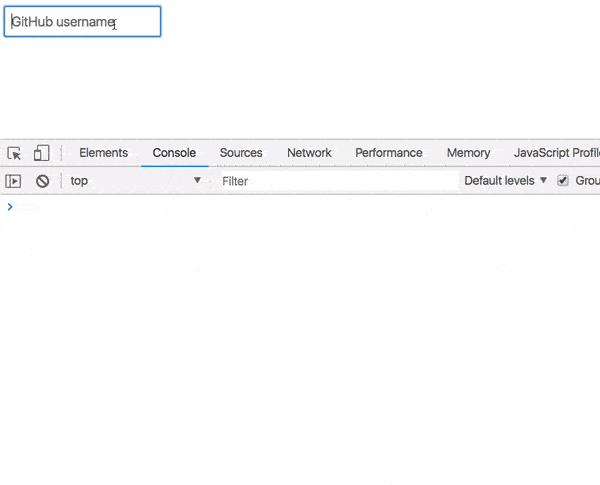

这是个很好的开始，但我们仍需要获取真正的用户信息。

## 获取 User

Github 的 User API 接口为 [`https://api.github.com/users/${user}`](https://api.github.com/users/$%7Buser%7D.)。我们可以轻易地将其放到 `User/index.js` 的一个辅助函数里：

```javascript
const formatUrl = user => `https://api.github.com/users/${user}`;
```

现在，我们可以在 `filter` 后面添加 `map(formatUrl)`：

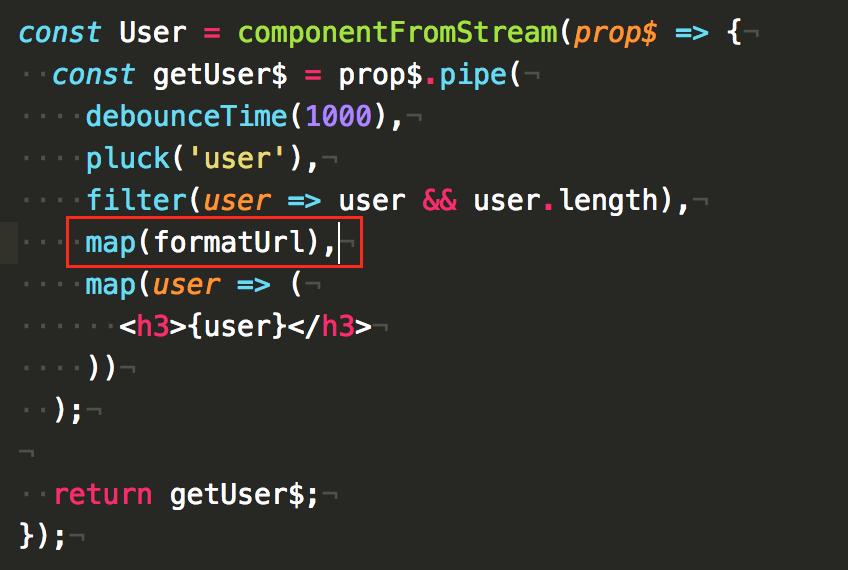

输入完成后，屏幕上很快就会出现预期的 API endpoint。

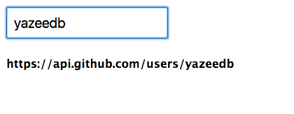

但我们需要的是把这个 API 请求发出去！现在就该让 `switchMap` 和 `ajax` 登场了。

### switchMap

`switchMap` 非常适合将一个 observable 对象**切换**为另一个，这对于处理用户输入上还是很有用的。

假设用户输入了一个用户名，我们在 `switchMap` 中获取其用户信息。

但在结果返回之前，用户又输入了新的东西，结果会是如何？我们还会在意之前的 API 响应吗？

并不会。

`switchMap` 会取消掉先前的请求，从而专注于处理当前最新的。

### ajax

RxJS 提供了自己的 `ajax` 实现，且和 `switchMap` 配合得非常棒！

### 实际应用

让我们先导入这两样东西。代码如下：

```javascript
import { ajax } from 'rxjs/ajax';
import {
  debounceTime,
  filter,
  map,
  pluck,
  switchMap
} from 'rxjs/operators';
```

然后像这样使用它们：

```javascript
const User = componentFromStream(prop$ => {
  const getUser$ = prop$.pipe(
    debounceTime(1000),
    pluck('user'),
    filter(user => user && user.length),
    map(formatUrl),
    switchMap(url =>
      ajax(url).pipe(
        pluck('response'),
        map(Component)
      )
    )
  );

  return getUser$;
});
```

将我们的 `input` 流**切换**为 `ajax` 请求流。一旦请求完成，`response` 就会被提取出来，并 `map` 到我们的 `User` 组件中去。

搞定！

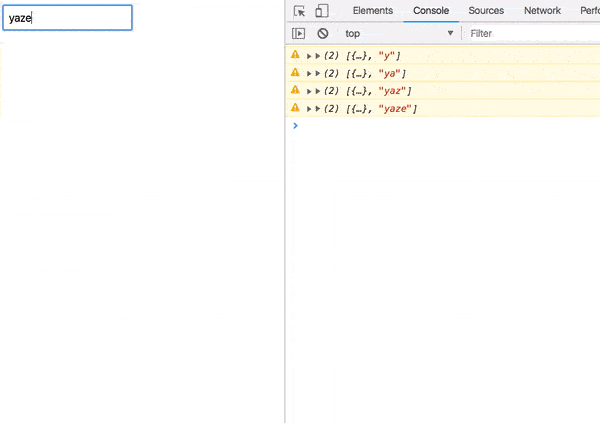

## 错误处理

试着输入一个不存在的用户名。

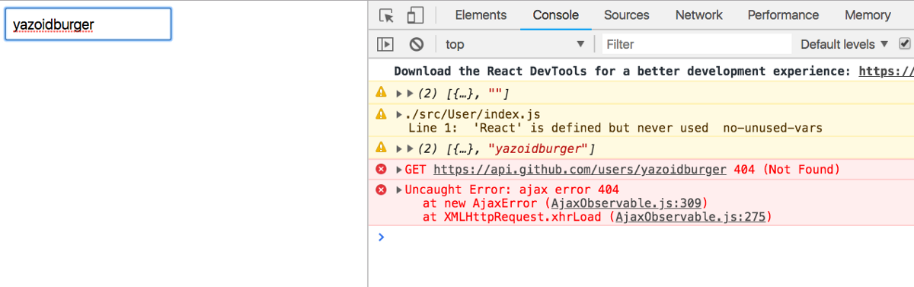

即便你改对了，我们的程序依旧是崩溃的。你必须刷新页面来重新获取用户信息。

是不是非常蛋疼？

### catchError

有了 `catchError` 操作符，我们可以显示一个合理的错误提示，而非直接卡死。

导入之：

```javascript
import {
  catchError,
  debounceTime,
  filter,
  map,
  pluck,
  switchMap
} from 'rxjs/operators';
```

并将其复制到 `ajax` 链的尾部。

```javascript
switchMap(url =>
  ajax(url).pipe(
    pluck('response'),
    map(Component),
    catchError(({ response }) => alert(response.message))
  )
)
```

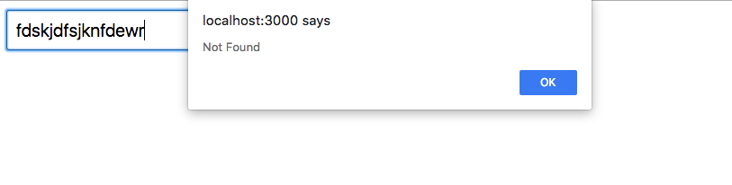

现在至少有一些回馈了，但还可以更完善一些。

### Error 组件

在 `src/Error/index.js` 创建一个新组件：

```javascript
import React from 'react';

const Error = ({ response, status }) => (
  <div className="error">
    <h2>Oops!</h2>
    <b>
      {status}: {response.message}
    </b>
    <p>Please try searching again.</p>
  </div>
);

export default Error;
```

它会友好地显示我们 AJAX 请求中的 `response` 和 `status`。

让我们把它导入进 `User/index.js`：

```javascript
import Error from '../Error';
```

同时，从 RxJS 中导入 `of`：

```javascript
import { of } from 'rxjs';
```

记住，我们 `componentFromStream` 的回调函数必须返回一个 observable 对象。我们可以用 `of` 来实现。

更新代码：

```javascript
ajax(url).pipe(
  pluck('response'),
  map(Component),
  catchError(error => of(<Error {...error} />))
)
```

其实就是简单地将 `error` 对象作为 props 传递给我们的组件。

现在，再看一下效果：

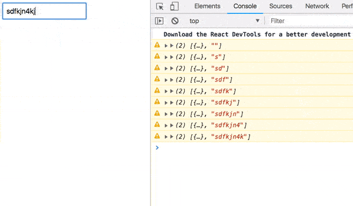

啊~好多了！

## 加载指示器

一般来说，我们现在需要某种形式的状态管理。那么如何构建一个加载指示器呢？

但在请 `setState` 出马之前，让我们看看用 RxJS 该怎么解决。

[Recompose 的文档](https://github.com/acdlite/recompose/blob/master/docs/API.md#observable-utilities)让我有了这方面的想法：

> 组合多条数据流来代替 setState()。

**注**：我一开始用的是 `BehaviorSubject`，但后来 [Matti Lankinen](https://medium.com/@milankinen) 回复了我，告诉了我一个绝妙的方法来简化代码。谢谢你，Matti！

导入 `merge` 操作符。

```javascript
import { merge, of } from 'rxjs';
```

当请求准备好时，我们会将 `ajax` 流和 Loading 组件流合并到一起。

在 `componentFromStream` 中这样写：

```javascript
const User = componentFromStream(prop$ => {
  const loading$ = of(<h3>Loading...</h3>);
  const getUser$ = ...
```

一个简单的 `<h3>` 加载指示器转变成了一个 observable 对象！接着就可以合并了：

```javascript
const loading$ = of(<h3>Loading...</h3>);

const getUser$ = prop$.pipe(
  debounceTime(1000),
  pluck('user'),
  filter(user => user && user.length),
  map(formatUrl),
  switchMap(url =>
    merge(
      loading$,
      ajax(url).pipe(
        pluck('response'),
        map(Component),
        catchError(error => of(<Error {...error} />))
      )
    )
  )
);
```

我很喜欢如此简洁的写法。在进入 `switchMap` 后，合并 `loading$` 和 `ajax` 这两个 observable。

因为 `loading$` 是一个静态值，所以会率先呈现。一旦异步 `ajax` 完成，其结果就会代替 Loading，显示到屏幕上。

在测试之前，我们可以导入一个 `delay` 操作符来放缓执行过程。

```javascript
import {
  catchError,
  debounceTime,
  delay,
  filter,
  map,
  pluck,
  switchMap,
  tap
} from 'rxjs/operators';
```

并在 `map(Component)` 之前调用：

```javascript
ajax(url).pipe(
  pluck('response'),
  delay(1500),
  map(Component),
  catchError(error => of(<Error {...error} />))
)
```

最终效果如何？

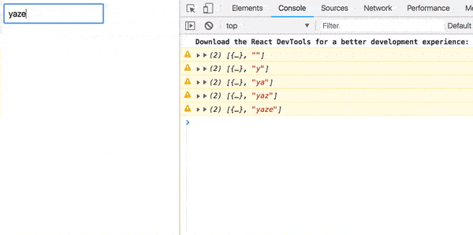

我很想知道该模式在未来会如何发展，以及是否可以走的更远。欢迎在下面评论并分享你对此的看法！

记得点个赞哟。（最多可以点 50 次！）

那我们下次见咯。

Take care,<br/>
雅泽·巴扎多 Yazeed Bzadough<br/>
[http://yazeedb.com/](http://yazeedb.com/)
