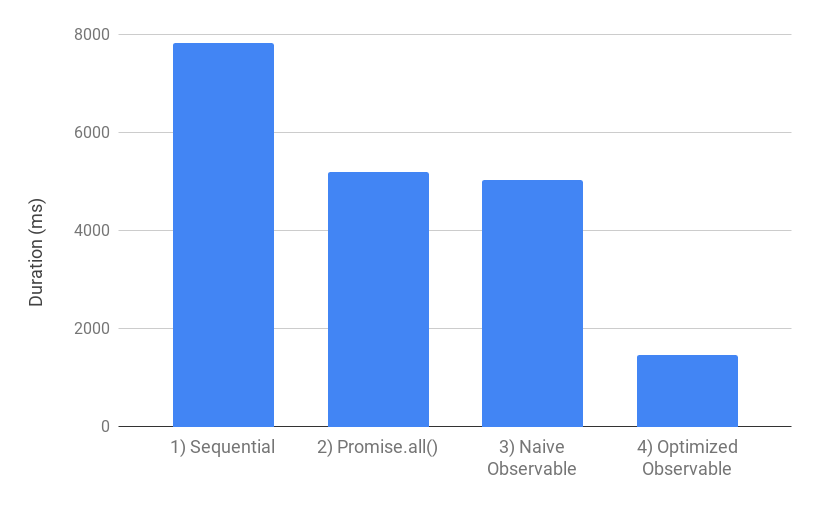
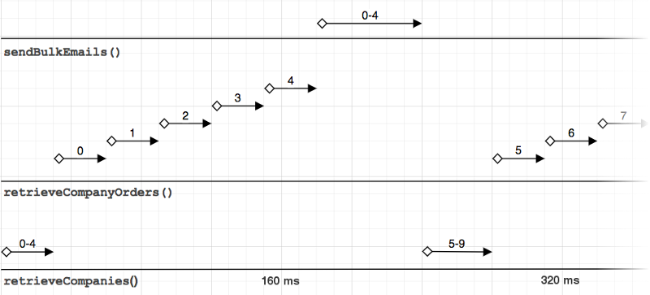
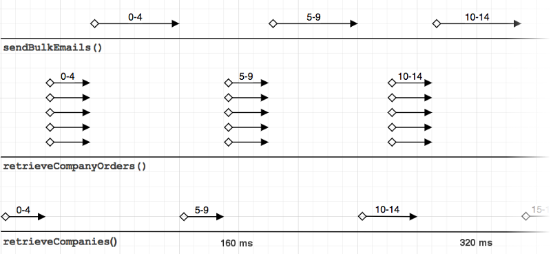

# [译] 使用 RxJS 优化批处理作业

> 原文链接：[Optimizing Batch Processing Jobs with RxJS](https://medium.com/@ravishivt/batch-processing-with-rxjs-6408b0761f39)<br/>
> 原文作者：[Ravi Mehra](https://medium.com/@ravishivt)；发表于2019年4月8日<br/>
> 译者：[yk](https://github.com/m8524769)；如需转载，请注明[出处](https://github.com/m8524769/RxJS-Article-Translation)，谢谢合作！

批处理并不是什么稀奇的东西。不过是检索数据，处理数据，周而复始。它没有花哨的界面，只是接受尽可能少的输入，然后默默地完成工作。但探索如何优化批处理却是一个非常有意思的过程。当你一点一点地提升代码的效率时，当你将程序运行时间从几天缩短至几小时，甚至几分钟时，你会觉得自己简直就是一个算法天才。

优化策略通常是趋同的：在避免资源过载的情况下，最大限度地提升并发性能。在两者之间做出权衡会是一大挑战。因此，我们需要正确的工具集和处理模型来达到优化目的。[RxJS](https://rxjs.dev/guide/overview) 正是其中之一。

在本文中，我们将着眼于使用 RxJS 以响应式的方法来处理常见的批处理模式。我们还会将此与传统的方式进行比较，并基于视图和基准进行评估。虽然响应式的方法会使编码过程更为复杂，但当你在设计下一个批处理作业时，性能和灵活性的提升会使 RxJS 变得尤为瞩目。

下图体现了各个方案之间效率的差距，最终我们将达到 5.3 倍的提速！



## 概要

Observable（可观察对象）是个非常棒的东西，可用于提高批处理作业的效率，但代价是我们需要额外地以响应式的思维方式来思考问题，也许最终并不会提升多少性能，徒增复杂度。

如果你已经很熟悉 RxJS 了，那么我建议你倒过来读这篇文章。首先阅读并分析[使用 observable 的最佳优化代码](https://codesandbox.io/s/m5qmvnklkj?module=%2Fsrc%2Fapproaches%2F4-observableImproved.ts)以获得粗略理解。然后再回到文章中，搞明白它的工作机制以及为何比使用 `Promise.all()` 要来的好。如果你并不是很熟悉 RxJS，也可以这么干，但是会比较吃力。

## 批处理的背景

以下是一些批处理作业的例子：

- 遍历 API 的分页数据列表，获取每条记录的详细信息，并在 ElasticSearch 中对其进行索引。
- 从数据库中获取数据，与其他数据进行聚合，生成 HTML 报告并通过电子邮件的形式发送出去。
- 读取数据库并为网络爬虫生成 sitemap.xml。
- 使用种子数据（seed data）初始化数据库，可以是随机数据。

> 译者注：[Elasticsearch](https://www.elastic.co/cn/) 是一个开源的分布式 RESTful 搜索和分析引擎。

批处理作业可以通过两种方式启动：由开发人员手动执行或按计划任务自动执行（task runner）。理想情况下，手动执行的作业需要几秒钟，或最多几分钟来完成。然而对于开发人员来说，每一秒都很重要。因为在执行完成之前，我们只能干等着。对于我而言，在终端前等的时间越长，就越有可能分心。注意力涣散，意识模糊，然后就刷起了知乎。理由很简单：“与其干等几分钟，不如刷会儿知乎放松放松”。然后刷着刷着，十几分钟就过去了。

对于自动执行的计划任务来说，耗时较长的任务就不那么碍眼了。这种任务一般只要设置完就可以把它抛到脑后了。然而，其糟糕的性能意味着我们不能频繁执行它。对于有些耗时超过一小时的任务，我们就会把它设置成每两小时执行一次，而非每小时都执行。在任务执行期间，其处理的数据集也可能会因为时间的推移而变“脏”。如果一个计划任务的工作是每小时收集一次统计数据，却要耗时 40 分钟，那么报告中的数据究竟属于哪个时间点？

不过好在几乎所有的批处理作业都可以通过并发（concurrency）来提高效率，而且效果十分明显。由于批处理作业会遍历数据集并执行某些操作，因此采用并发就能显著提高效率。但是，以高效的方式实现并发处理并没有那么容易。

在 JavaScript 中，有很多工具可以帮助我们利用异步操作的并发性，比如 Promise、ES2017 中的 async/await、ES2018 中的异步迭代（async iteration）、NodeJS 流，以及一些第三方库，比如 [bluebird](http://bluebirdjs.com/docs/getting-started.html)、[scramjet](https://github.com/signicode/scramjet) 和 [async](https://github.com/caolan/async)。还有一个就是在前端应用中较为流行的：[RxJS](https://github.com/ReactiveX/rxjs)。这些工具各有千秋，我们会将 RxJS 与其余的几个进行比较。

## RxJS

[RxJS](https://github.com/ReactiveX/rxjs) 在前端开发方面有着很大的吸引力，因为它与前端环境是完美适配的。它将用户视为与应用程序交互并随时会发出值的 Observable。按钮点击、页面导航、文本输入，所有的这类事件都会被应用程序以结构化的方式观察到。事件会通过代码传播，从而导致状态变更，触发网络请求或者 DOM 的更改。RxJS 提供了大量的操作符，你可以通过你想要的任何方式来处理事件。

鲜为人知的是，RxJS 也是批处理的绝佳工具。在批处理场景下，我们可以将数据源（如：数据库）视为一个 Observable，随着时间的推移发出我们所需的批量数据。然后我们可以使用诸如 mergeMap 或 concatMap 之类的 Observable 操作符来处理数据。

本文不会过多介绍 RxJS/Observable 以及它们的工作方式。因为涉及的面太广，而且已经太多优秀的文章可以让我们学习了。我们将探索如何使用 RxJS 来高效的解决批处理作业，并仔细分析其中的原理。如果你是 RxJS 的新手，我建议你通过这两篇文章来获得对 RxJS 的初步了解：[The introduction to Reactive Programming you’ve been missing](https://gist.github.com/staltz/868e7e9bc2a7b8c1f754) 和 [Learn to combine RxJs sequences with super intuitive interactive diagrams](https://blog.angularindepth.com/learn-to-combine-rxjs-sequences-with-super-intuitive-interactive-diagrams-20fce8e6511)

> 译者注：这两篇文章都已有对应译文，分别是[极客学院 Wiki](http://wiki.jikexueyuan.com/) 的[响应式编程（Reactive Programming）介绍](http://wiki.jikexueyuan.com/project/android-weekly/issue-145/introduction-to-RP.html)和 [RxJS 中文社区](https://github.com/RxJS-CN)的 [ [译] RxJS: 使用超直观的交互图来学习组合操作符](https://github.com/RxJS-CN/rxjs-articles-translation/blob/master/articles/Learn-To-Combine-RxJS-Sequences-With-Super-Intuitive-Interactive-Diagrams.md)

注意，并不是说只要将批处理作业转换为 RxJS 和 Observable 就可以提高效率的。我们需要设计操作符之间的链式调用来使整体的效率最大化。例如，我们可以利用 `mergeMap` 操作符和 `concurrent` 选项来同时执行一部分操作。

### 背压（Back-pressure）

_本节更适合有 RxJS 使用经验的读者，初学者可随意跳过。_

我认为 RxJS 没有被广泛地用于批处理有这样两个原因：其一，额外的学习成本；其二，缺乏处理无损背压的案例。背压是一个比较复杂的话题，其核心问题是：生产者提供数据的速度快于消费者可以接收并处理数据的速度。你可以想象一个排水管被塞住一半的水槽，由于其排水（处理数据）的过程会比平常来的更慢，所以水槽（堆内存）会被逐渐占满并最终溢出。

批处理作业通常需要以受控方式来处理海量数据（分批/分页/分块）。如果不这样做，那么程序就会因以下原因而崩溃：

- 内存被挤爆；
- 数据库连接耗尽；
- 达到 API 服务器的访问频率限制；
- API/数据库性能骤降。

因此，背压管理的重要性不言而喻。RxJS 提供了有损和无损两种背压策略，但对于批处理作业而言，有损是不用考虑的，因为我们不能跳过任何数据。

我发现 RxJS 中的几乎所有无损背压方案都需要在声明 observable 时提供整个数据集，例如：`from(entireDatasetArray)`，而这是不现实的。所以，我们需要一种“响应式拉取（reactive pull）”的方式来替代，也就是控制数据拉取的频率。

在本文提供的示例中，我将借助 RxJS 的 `Subject` 来实现一种更为清晰的的背压管理解决方案。简而言之，就是在处理了一批数据之后，调用 `Subject.next()` 来拉取/获取下一批数据。这样，我们就可以随时控制数据流的大小。以下两篇文章是我的灵感来源：

- [RXJS control observable invocation](https://stackoverflow.com/a/35347136/684893)
- [Lossless Backpressure in RxJS](https://itnext.io/lossless-backpressure-in-rxjs-b6de30a1b6d4)

## 示例——场景及设定

我们需要一个相对真实的批处理场景来评估现有的解决方案。为了使其有趣一些，我会施加一些限制。下面就是我们将要处理的场景：

1. 以分页的方式从数据库中获取公司列表（每页 10 条）。每次获取的记录条数应当为 `batchSize` 的值，并且内存每次读取的记录条数不应超过 `maxQueueSize`。另外，同时执行的数据库查询语句条数也不应当超过 `retrieveCompaniesConcurrency`。
2. 获取每个公司的订单列表。假设其对应了一个 API 请求，为了避免频繁请求而触发访问限制，我们会设置 `retrieveOrdersConcurrency` 参数来控制请求的并发量。
3. 将收集到的各公司订单信息做成报告，并通过电子邮件的方式发给他们。假设我们有一个处理电子邮件的 API 服务器，它可以单独地收发邮件，但在同时收发多个邮件的情况下性能会更好。我们应当将单个 API 请求中的邮件数量限制为 `bulkEmailCount`。同时，也要像获取订单一样设置一个 `bulkEmailConcurrency` 来限制访问的频率。

为了演示该场景，我们将模拟上述三个异步操作。

1. `retrieveCompanies(limit: number, offset: number): Promise<Company[]>` 使用 [faker.js](https://github.com/marak/Faker.js/) 来生成公司数据，数据量为 `totalCompanyCount`，支持 `limit` 和 `offset` 参数来获取分页数据。
2. `retrieveCompanyOrders(company: Company): Promise<Order[]>` 再次使用 faker.js 为每个公司生成个数为 `ORDERS_PER_COMPANY` 的订单。
3. `sendBulkEmails(emailData: Company[]): Promise<void>` 一个无操作（no-op）调用，因为我们不期望得到任何回复。

我们将用 `setTimeout()` 为每个操作设置一个延时，从而模拟一个真实的异步调用环境，且所有的延时都是可调整的参数。出于本文的目的，我们将使用以下这些常量来设定参数，以便公平地比较各个解决方案。

```typescript
export const defaultBatchProcessingOptions: BatchProcessingOptions = {
  batchSize: 5,
  maxQueueSize: 15,
  retrieveCompaniesConcurrency: 1,
  retrieveOrdersConcurrency: 5,
  bulkEmailConcurrency: 5,
  maxBulkEmailCount: 5,
};
const TOTAL_COMPANY_COUNT = 100;
const RETRIEVE_ONE_COMPANY_DELAY = 6;
const RETRIEVE_ONE_COMPANY_ORDER_DELAY = 5;
const ORDERS_PER_COMPANY = 6;
const SEND_BULK_EMAILS_DELAY = 60;
```

在设置了这些参数后，我们可以计算出：

- `retrieveCompanies()` 将耗时 30ms（`batchSize * RETRIEVE_ONE_COMPANY_DELAY === 30`）
- `retrieveCompanyOrders()` 也将耗时 30ms（`ORDERS_PER_COMPANY * RETRIEVE_ONE_COMPANY_DELAY === 30`）
- `sendBulkEmails()` 将耗时 60ms（`SEND_BULK_EMAILS_DELAY`）。

观察延时的调整以及随机因素的添加将如何影响各个方法的运行时间是个十分有趣的过程，其结果并非总是呈线性的。本文将尝试各种各样的参数配置，你可以随意更改这些参数。正如我们稍后将看到的，优化后的 observable 解决方案实际上可以利用在其他方案中难以解决的随机性。

并非所有方案都要用到这些参数，有些参数仅在一些进阶场景下才用得到。对于简单的场景，我们不会违反任何约束条件，因为那样效率太低了。

在 [_`utils.ts`_](https://codesandbox.io/s/m5qmvnklkj?fontsize=14&module=%2Fsrc%2Futils.ts&view=editor) 中，你可以找到上述异步操作的完整实现，包括生成随机数据以及批处理的参数选项。

另外，[_`index.ts`_](https://codesandbox.io/s/m5qmvnklkj?fontsize=14&module=%2Fsrc%2Findex.ts&view=editor) 文件是我们测试每一种方案的入口。每种方案都会测试三次，并最终输出平均结果。如果你对某些测试不感兴趣的话，可以在下面评论。

## 方案一——使用 Async/Await 顺序执行

第一个方案是最戆的，就是用 async/await 来遍历每个公司，依次获取他们的订单，然后发邮件，直到 `retrieveCompanies()` 不返回数据为止。`BatchProcessingOptions` 中唯一用到的参数是 `batchSize`，用来控制单次获取的数据量。

```typescript
export const approach1AsyncAwait = async (options?: BatchProcessingOptions) => {
  options = {
    ...defaultBatchProcessingOptions,
    ...options,
  };
  for (
    let curOffset = 0;
    curOffset < Infinity;
    curOffset += options.batchSize
  ) {
    const curBatch = await retrieveCompanies(options.batchSize, curOffset);
    if (curBatch.length === 0) {
      break;
    }
    for (const company of curBatch) {
      company.orders = await retrieveCompanyOrders(company);
    }
    await sendBulkEmails(curBatch);
  }
};
```

### 性能：~5313ms

这将作为我们的性能基线，用于衡量其它几个方案的性能。

### 可视化



在图表中，我们可以看到三个操作：`retrieveCompanies()`、`retrieveCompanyOrders()` 和 `sendBulkEmails()`。每个水平刻度为 10ms，也就是说，`retrieveCompanies()` 和 `retrieveCompanyOrders()` 花费了 30ms，而 `sendBulkEmails()` 花费了 60ms。每个箭头代表了完成的时间。

每个箭头上的数字对应的是正在处理的公司的索引。`retrieveCompanies()` 上面的 `0-4` 代表获取的头五个公司 `[0-4]`。在 `retrieveCompanyOrders()` 中，各个箭头上的数字代表获取第 n 个公司的订单。

这里的重点是：没有重叠的箭头。每个操作都只在上一个操作完成之后才会开始，这就意味着任何操作都不是并发的，从而拖慢了执行时间。

### 需要改进的方面

最明显的瓶颈就是它的同步和顺序性，如果我们能够同时处理这些订单数据，那么性能将会大幅上升。

## 方案二——使用 Promise.all() 实现并发

`Promise.all()` 允许我们同时运行多个异步操作。它将所有内部的 promise 打包为一个 promise，只有在内部的 promise 统统完成后，它才会 resolve。通过它我们可以为每一批数据同时执行所有的 `retrieveCompanyOrders()`。

```typescript
export const approach2PromiseAll = async (options?: BatchProcessingOptions) => {
  options = {
    ...defaultBatchProcessingOptions,
    ...options,
  };
  for (
    let curOffset = 0;
    curOffset < Infinity;
    curOffset += options.batchSize
  ) {
    const curBatch = await retrieveCompanies(options.batchSize, curOffset);
    if (curBatch.length === 0) {
      break;
    }
    await Promise.all(
      curBatch.map(async company => {
        company.orders = await retrieveCompanyOrders(company);
      }),
    );
    await sendBulkEmails(curBatch);
  }
};
```

### 性能：~2631ms

相较于方案一提升了 2.44 倍

### 可视化



对比图表，我们不难发现 `retrieveCompanyOrders()` 是同时进行的，在 320ms 这个时间点上，该方案已经在处理公司 `10-14` 了，而方案一还在处理公司 `5-9`。

### 需要改进的方面

`Promise.all()` 的一个问题是它容易受到最薄弱环节的影响。假设我们在 `Promise.all()` 中执行十个 `retrieveCompanyOrders()`。其中九个都在 20ms 内完成了，而有一个却因为某些原因花了 200ms（比如网络故障）。由于 `Promise.all()` 的性质，使得它得等到 200ms 才能 resolve。那么，我们是否可以继续处理那九个先到的数据，随后再处理最慢的那个？提示：不妨将数据视为流（可观察对象）。

还有一个问题是：即使我们已经实现了 `retrieveCompanyOrders()` 的并发执行，但其余两个异步操作：`retrieveCompanies()` 和 `sendBulkEmails()` 的效率并没有得到提高。

让我们来做个更大胆的设想，目前我们的 pipeline（管道）会等待当前批次的订单处理完成后才会处理下一批。那么我们是否可以在当前的数据处理完成之前就获取下一批数据呢？如此一来，一旦 pipeline 空闲下来，我们就可以预加载下一批数据，然后将其放入队列等待处理。举个例子，假如我的处理队列中有 20 封待发邮件，而我的电子邮件 API 每次最多只能同时发送 5 封，但实际上我可以同时运行两个 `sendBulkEmails()` 来发送前 10 封邮件，随后再以同样的方式发送后 10 封邮件。

为了实现这些改进，我们需要施加一些约束条件，以确保程序的可控性。如果没有约束条件的话，我们也许会过于激进，从而导致内存耗尽；或者触发访问限制；又或者是耗尽数据库连接等等。这些约束条件都包含在之前提到的 `BatchProcessingOptions` 里。

事实上，使用有限的 `async/await` 和 `Promise.*()` 来实现上述的改进是相当困难的。那么该怎么办呢？是时候引入 observable 了！

总结一下优化思路：

1. 避免 `Promise.all()` 受到最薄弱环节的影响。
2. 使更多的异步任务并发执行。
3. 通过预加载和数据队列来优化 pipeline。
4. 通过一些约束条件来限制并发量和数据提取。

## 方案三——用 observable 替代 Promise.all()

既然我们已经认识到了上一种方案的局限性，那么我们来看看用 observable 和 RxJS 是否可以做出一些改善。不过在真正展现 observable 的力量之前，我们先尝试一下简单的替换。

该方案并不是为了提高效率或是性能，而只是一个简单的热身，同时也是一个学习的机会。我们将学习一些有趣的 RxJS 操作符，例如：`mergeMap()` 和 `mergeScan()`。我们还将看到 RxJS `Subject` 是如何通过处理分页数据来实现无损背压的。

```typescript
export const approach3Observable = async (options?: BatchProcessingOptions) => {
  options = {
    ...defaultBatchProcessingOptions,
    ...options,
  };
  validateBatchProcessingOptions(options);
  let curBatchReceivedCount = 0;
  // 从 0 开始迭代
  const controller$ = new BehaviorSubject(0);

  return controller$
    .pipe(
      /**
       * 获取下一批数据（当前位置的后 batchSize 条记录）
       */
      mergeMap(
        curOffset => retrieveCompanies(options.batchSize, curOffset),
        undefined,
        options.retrieveCompaniesConcurrency,
      ),
      /**
       * 将获取的公司数组打平为单独的公司记录
       * 这样一来，后面的操作符就可以对每个公司分别进行处理
       * 当获取的数据为空时，结束迭代
       */
      mergeMap(companies => {
        curBatchReceivedCount = companies.length;
        if (companies.length === 0) {
          controller$.complete();
        }
        return from(companies);
      }),
      // 同时获取各个公司的订单
      mergeMap(
        async company => {
          company.orders = await retrieveCompanyOrders(company);
          return company;
        },
        undefined,
        options.retrieveOrdersConcurrency,
      ),
      /**
       * 累计当前批次中已处理的公司
       * 当该批次的数据全部处理完成后，批量发送邮件
       * 然后继续处理下一批
       */
      mergeScan(
        async (acc: any, company) => {
          acc.curBatchProcessed.push(company);
          /**
           * 我们不能与 `batchSize` 进行比较，因为我们可能无法获取完整批次的数据
           * 假设总共有 5 个公司，而我们的 `batchSize` 为 3
           * 那么最后一批数据将只包含两个公司（`companies[3-4]`）
           */
          if (acc.curBatchProcessed.length === curBatchReceivedCount) {
            await sendBulkEmails(acc.curBatchProcessed);
            acc.curBatchProcessed = [];
            acc.curOffset += options.batchSize;
            controller$.next(acc.curOffset);
          }
          return acc;
        },
        {
          curBatchProcessed: [],
          curOffset: 0,
        },
        1,
      ),
      catchError(async err => {
        console.log("err", err);
        return err;
      }),
    )
    .toPromise();
};
```

### 以 Observable 的方式思考

要理解这种方法的工作原理，我们首先得考虑如何处理流数据，我喜欢把它比作工厂的流水线。

我们将原始数据投入流水线中，随着流水线的运作，数据会被多个不同的机器加工。有些机器会需要较长的时间来处理数据，以至于跟不上数据获取的速度，就如同下图一样：


为了避免这种情况，我们可以暂停流水线，直到当前的工作完成。当所有的数据都通过了整条流水线的处理后，工作就算完成了。

回到 observable，这里的流水线就可以看作是一个 observable，而流水线中的机器就是 RxJS 中的各种操作符，比如 `mergeMap` 和 `mergeScan`，它们在 `pipe()` 中按顺序排列。

现在让我们分析 `mergeMap` 和 `mergeScan` 操作符的作用。

#### mergeMap

`mergeMap` 在这里极其重要。根据其在[文档](http://reactivex.io/rxjs/class/es6/Observable.js~Observable.html#instance-method-mergeMap)中的描述，_它会将每个输入的值分别映射到 observable 中，最后再将它们合并输出。_ 什么意思呢？就是说它可以用来接收数据、处理数据，并把处理后的数据传递给下面的操作符，就好比 `Array.map()`。

但与 `Array.map()` 不同的是，它除了可以用来映射，它还支持仅适用于流数据的 _merge（合并）/ flatten（打平）_ 操作，区别就在于：`mergeMap` 可以输出比它接收的更多/少的数据，并将其合并到输出流中，这也是 `mergeMap` 之前被叫做 `flatMap` 的原因，因为它可以用来 flatten（打平）数据。

为了解释 `mergeMap` 和 _merge/flatten_，让我们先假设有一条流水线和一些装有甜甜圈的盒子。流水线上共有两台机器，其中一台负责将甜甜圈从盒子中取出并放到流水线上，另一台则负责咬一口甜甜圈，以确保食品的质量。

```typescript
const boxes$ = from([ [d1, d2, d3], [d4, d5, d6] ]);

boxes$.pipe(
  // 依次打开每个盒子并将甜甜圈放到流水线上
  mergeMap(box => from(box)),
  // 用 `bite()` 处理每个流水线上的甜甜圈并输出
  mergeMap(async donut => {
    return await bite(donut);
  })
)
```

值得注意的是，在第一个 `mergeMap` 中我用 RxJS 的 `from()` 来打开甜甜圈盒子，`from()` 会创建一个新的 observable，用于将数组中的每一个对象单独发送出去。随后，`mergeMap` 就会将甜甜圈们分别放到流水线上。另一个值得注意的地方是，在第二个 `mergeMap` 中，返回值并非一定得是 Observable，我要是想返回一个 `Promise` 也是可以的。当返回值为 promise 时，`mergeMap` 会等待其完成，并将结果发送给下游处理。

了解完 `mergeMap` 后，该方案就很好理解了。

```typescript
// 获取下一批数据（当前位置的后 batchSize 条记录）
mergeMap(
  curOffset => retrieveCompanies(options.batchSize, curOffset),
),
// 将获取的公司数组打平为单独的公司记录
mergeMap(companies => {
  return from(companies);
}),
// 现在就可以单独操作每一个公司的数据了
mergeMap(async company => {
  company.orders = await retrieveCompanyOrders(company);
  return company;
}),
```

另外，`mergeMap` 在批处理作业中还有一个十分吸引人的特性，那就是我之前没有提到的并发能力。默认情况下，`mergeMap` 会同时处理所有输入值，有多少就处理多少。我们还可以通过 `concurrent` 参数来控制 `mergeMap` 的并发处理量，假如我们将 `concurrent` 设置为 5，那么 `mergeMap` 将只会同时处理 5 个任务，其余任务则会进入队列。当我们不想让 `mergeMap` 同时处理多个任务时，将 `concurrent` 设置为 1 就行了。

#### mergeMap vs Promise.all

那么 `mergeMap` 和 `Promise.all()` 在并发处理异步任务上究竟有何不同呢？首要的一点就是，`mergeMap` 可以通过 `concurrent` 参数轻易地控制并发量。请记住，我们通常不应将所有任务并发处理，因为可能会导致系统崩溃，达到访问限制，内存耗尽等一系列问题。相对而言，使用 `Promise.all()` 来控制并发量则要困难得多，我们必须将输入的数组分块，以对应我们想要的并发处理量。

第二点是，当 `mergeMap` 完成了一个任务后，它可以立即将数据发给下游处理，而不必像 `Promise.all()` 一样需要等待所有任务都完成。这一切都得益于 observable（即流数据），而 `Promise.all()` 处理的是数组，所以做不到这一点。

当我们遇到网络延迟的故障时，单独处理数据的能力就显得十分有用了
